# __Task Documentation__

## __Overview of this Document__

This document is intended for users with basic knowledge of R who aim to analyze their own album rating trends. By the end of this document, you will be able to:

- Create your own dataset.
- Set up a web app with the modified dataset on Windows.

### Sections:

>- How to install MyFavoriteAlbums locally from GitHub.
>- How to install MyFavoriteAlbums dependencies.
>- How to make a custom Album Data Set.
>- How to test your custom CSV file.
>- How to set up a web app via Shiny.

## __Pre-Requisites__

- **RStudio** installed (or another IDE; this tutorial uses RStudio on Windows).
- Installed dependencies:
  - `dplyr`
  - `ggplot2`
  - `DT`
  - `shiny`
- A Shiny account: [ShinyApps](https://www.shinyapps.io/).

### Extra Resources

- GitHub Repository: [MyFavoriteAlbums GitHub](https://github.com/UW-Example-Student/MyFavoriteAlbums).
- Web App Example: [MyFavoriteAlbums Web App](https://cholstro.shinyapps.io/shiny-music/).
- Conceptual Overview: [Document Link](https://docs.google.com/document/d/1fgNaafI6imLZbBhxNX6RYj1E47kIlwQ9EtkjRaCnZHw/edit?tab=t.0).

---

## __How to Install MyFavoriteAlbums Locally from GitHub__

1. Open **RStudio**.
2. Select **File > New Project**.

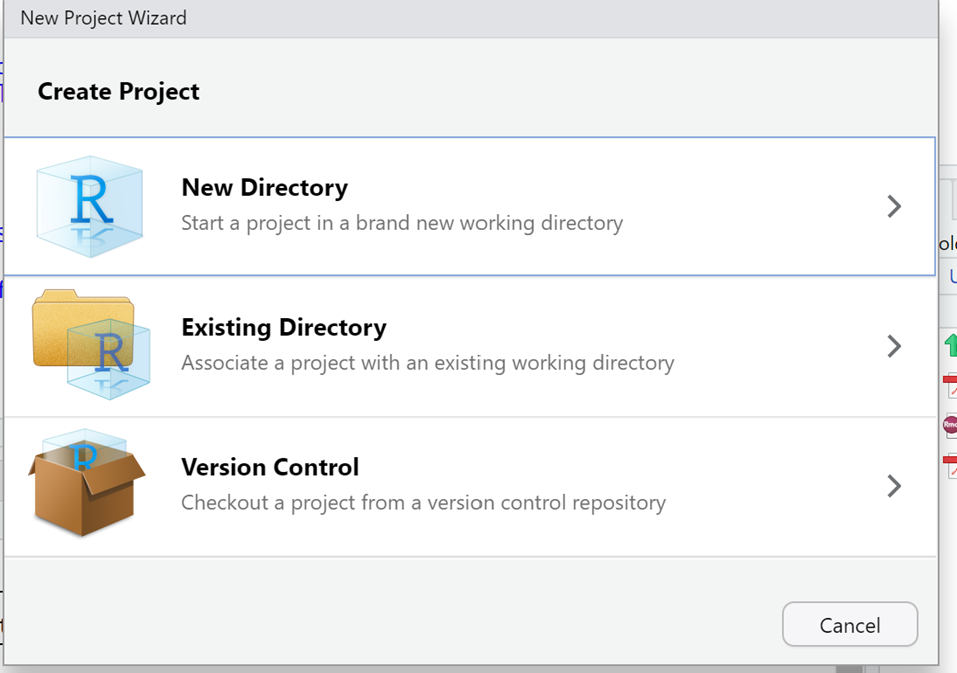

3. In the pop-up window, choose **Version Control** and then **Git**.
4. Paste the repository URL `https://github.com/UW-Example-Student/MyFavoriteAlbums.git` into the **Repository URL** field. Specify the directory where the project will be stored.

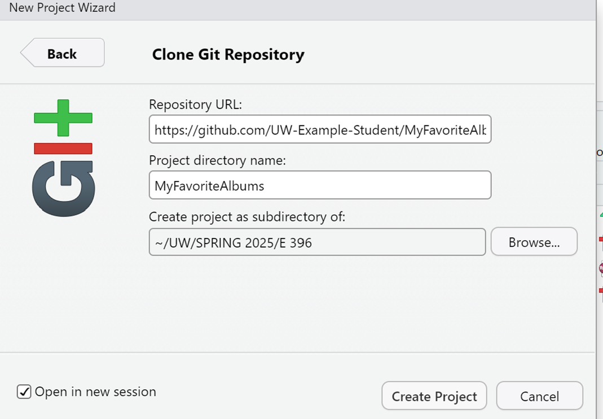

5. Click **Create Project**. You now have a local copy.

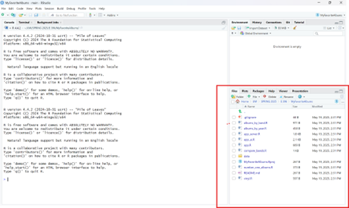

> **Note**: Verify that all files in your local directory match those in the GitHub repository.

---

## __How to Install MyFavoriteAlbums Dependencies__

The following packages are required:

- `dplyr`: Filters and aggregates data.
- `DT`: Provides interactive data tables.
- `shiny`: Enables web-based interactivity.
- `ggplot2`: Generates visualizations.

### Installation Steps

1. Open the RStudio Console.
2. Run the following commands to install each package:
   ```R
   install.packages("shiny")
   install.packages("DT")
   install.packages("dplyr")
   install.packages("ggplot2")
   ```
3. Ensure all packages are installed before running the app to avoid errors. You will see the following output after each install:

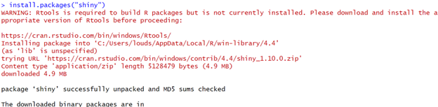

---

## __How to Make a Custom Album Data Set__

### Steps

1. Open the **Data** folder within your local copy of MyFavoriteAlbums in **RStudio**.
2. Select **album-rankings.csv** and click **View File**.

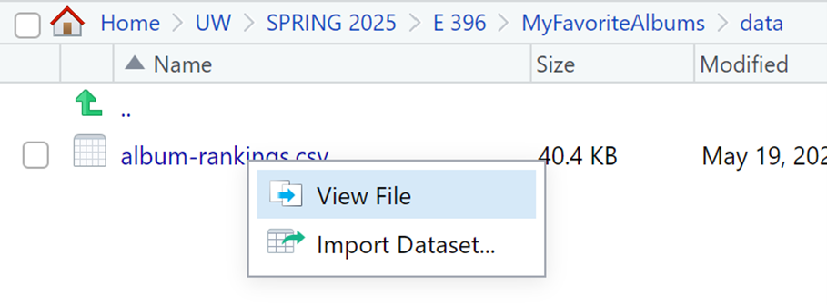

3. Edit the file directly in the RStudio Source Pane. Ensure your view matches the original file structure before making changes.

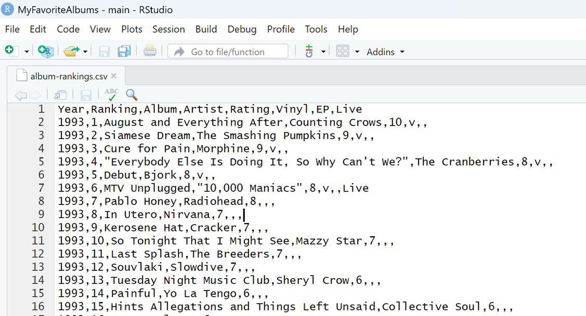

4. Delete all rows except the header (line 1).
5. Add your data to the file, following the structure exactly (see Reference).

## __How to Test Your Custom CSV File__

1. Open **app.R** in the RStudio File Explorer.

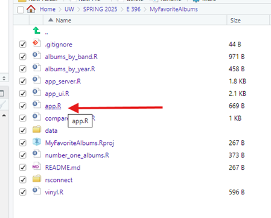

2. Click **Run App** within the RStudio Editor.

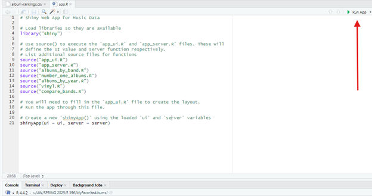

3. A local version of the app will load. Test all tabs to ensure that your data matches the CSV file.
   - Example: Verify that the "Number One Albums" tab displays the correct rankings.

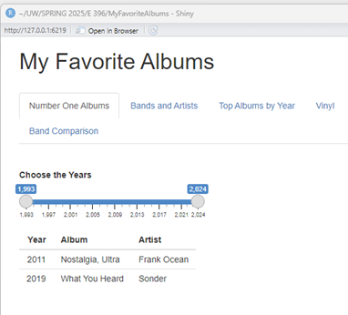

> **Note**: If issues arise, revisit the CSV file or dependencies to troubleshoot.

---

## __How to Set Up a Web App via Shiny__

1. Open **app.R** in the RStudio Editor.
2. Click **Publish** in the top-right corner of the RStudio Editor. The following screen will load after a few seconds:

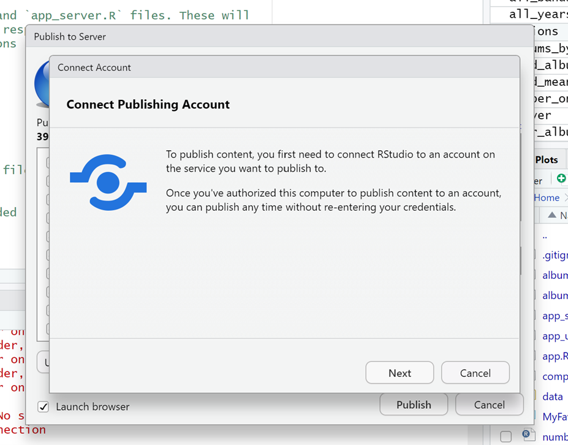

3. Follow the on-screen steps to connect your Shiny account and add the necessary token:
4. Click **Next**, log in if prompted, and complete the deployment process.
5. Finally click **Publish**, your web app will open in a browser with a unique URL.

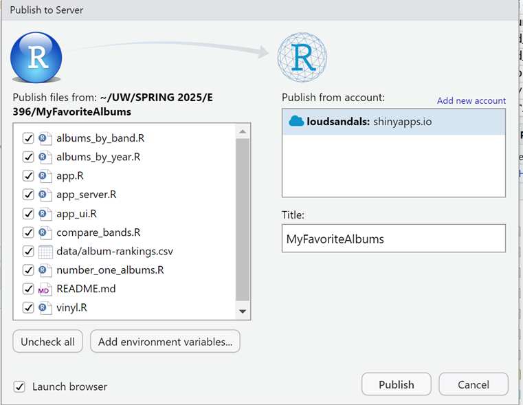

Example: [MyFavoriteAlbums Example Web App](https://loudsandals.shinyapps.io/MyFavoriteAlbums/).

---

## __Task Documentation Conclusion__

You now have a functional, customized MyFavoriteAlbums web app hosted via Shiny. Feel free to explore the R files for additional customization or use them as templates for your own projects.
